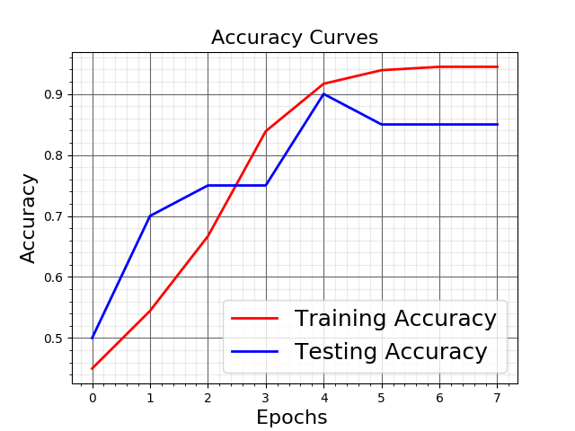
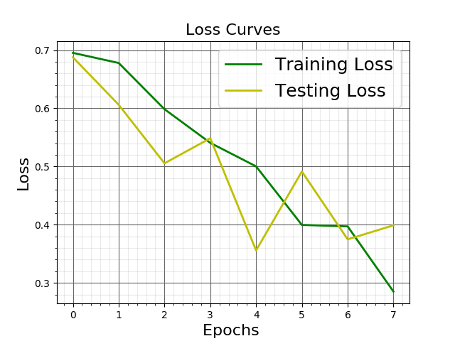

0. Insatall requirements
    > pip install -r requirements.txt

1. Download Dataset
    > wget -r -np http://www.physionet.org/physiobank/database/afpdb/

2. Copy paste afpdb folder here 
    > sudo mv www.physionet.org/physiobank/database/afpdb .

3. Create CSV files 
    > python dat2csv.py

4. Create training and test dataset
    > mkdir training test

5. Split manually dataset (afpdbCSV) to training and test:
    * My dataset has 180 training samples (90 normal + 90 abnormal) and   20 testing samples (10 normal + 10 abnormal)

6. Create .npy files 
    >  python create_dataset.py

7. Create Neural Network model and train it 
    > python train.py

8. Rename the best model from my_model.h5 to best.h5

9. Make predictions with best model (85% accuracy)
    > python predict.py

